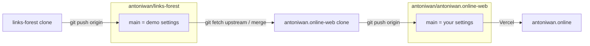

# Migration plan: template + public site

**Status:** ready to execute  
**Decision:** D3 — public downstream `antoniwan/antoniwan.online-web`  
**Live site:** [antoniwan.online](https://antoniwan.online) must not switch to the demo person.

Daily git after go-live: [WORKFLOW.md](./WORKFLOW.md).

## What you are building

Not a GitHub Fork. Same-account Fork is blocked. You create a **second public repo** and push this project’s git history into it.

| Repo | Job | Vercel |
| --- | --- | --- |
| `antoniwan/links-forest` | Template other people fork | not production |
| `antoniwan/antoniwan.online-web` | Your live identity | production for antoniwan.online |



## How the copy is made (not Finder copy-paste)

GitHub UI: New repository, **public**, name `antoniwan.online-web`, **empty** (no README).

From this clone, push existing history. That is the whole “copy”:

```bash
cd /Users/SOFTHEART/Developer/projects/links-forest
git checkout main
git pull origin main
git remote add site git@github.com:antoniwan/antoniwan.online-web.git
git push site main
git remote remove site
```

`git remote remove site` afterward so this template clone cannot accidentally push later work to the live site.

Then clone the new repo as a **second folder**:

```bash
cd /Users/SOFTHEART/Developer/projects
git clone git@github.com:antoniwan/antoniwan.online-web.git
cd antoniwan.online-web
git remote add upstream git@github.com:antoniwan/links-forest.git
git remote -v
```

You now have two working copies. That is the practice: template vs site, `origin` vs `upstream`.

## Rule that keeps production alive

**Point Vercel at `antoniwan.online-web` while public `links-forest` `main` still has your real settings.**

Only then replace template `user-settings.ts` with the demo person. Reverse that order and antoniwan.online ships the demo.

Rollback before the template swap: reconnect Vercel to `antoniwan/links-forest`. After the swap: fix settings on the site clone and push.

## Phases

### 0 — This branch (no Vercel change)

Prepare demo `user-settings.ts` content. Do **not** merge it to template `main` yet.

### 1 — Create and fill `antoniwan.online-web`

Empty public repo on GitHub. `git push site main` as above.

### 2 — Site clone + Vercel

Second folder, `upstream` remote, `pnpm install && pnpm dev` still looks like you.

Vercel (same project, keeps the domain): Settings → Git → disconnect `links-forest` → connect `antoniwan.online-web` → production branch `main` → deploy → check antoniwan.online in a private window.

### 3 — Template becomes the demo

Merge this branch to `links-forest` `main` so `user-settings.ts` is the fictional person. Site repo is untouched; it still has your file.

### 4 — First upstream merge (the new habit)

On `antoniwan.online-web`:

```bash
git fetch upstream
git merge upstream/main
```

If `user-settings.ts` conflicts, keep **ours**. Confirm it is still you, then `git push origin main`. Watch Vercel.

Optional, site repo only, so that file always wins:

```gitattributes
src/config/user-settings.ts merge=ours
```

```bash
git config merge.ours.driver true
```

### 5 — Use WORKFLOW.md

Template work in `links-forest`. Identity work in `antoniwan.online-web`. Never `git push upstream`.

## Done when

- [x] `antoniwan/antoniwan.online-web` exists (public)
- [x] Vercel production Git source is that repo
- [x] antoniwan.online still shows Antonio
- [ ] `links-forest` `main` shows the demo person
- [ ] One `git merge upstream/main` on the site clone kept your settings
